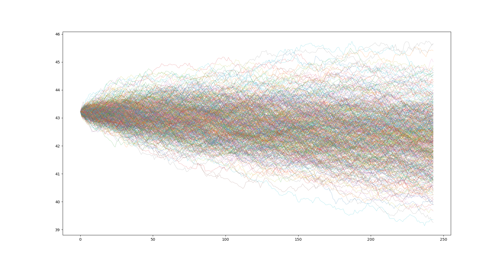

# Geometric Brownian Motion Simulation

This project implements a simulation of geometric Brownian motion (GBM) using Python. GBM is a mathematical model commonly used in finance to simulate the behavior of stock prices, currency exchange rates, and other financial instruments. It is based on the assumption that the logarithmic returns of the underlying asset follow a normal distribution.

## Features

- Calculate the drift and volatility of the simulated paths for a given Stock (MSFT for example).
- Simulate paths of a GBM process using Monte Carlo simulation.
- Visualize the simulated paths
- Calculate performance metrics, such as mean absolute percentage error (MAPE), for evaluating the accuracy of the simulation.

## Image of a simulation 

